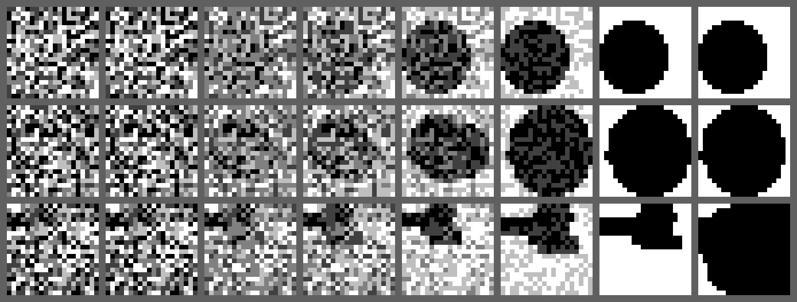

# Jiffusion

**Jev + gif + diffusion.** Start from pure grayscale noise and let [Jev](https://docs.typesafe.ai) steer it into a picture of your prompt. No image model: a random generator proposes edits, Jev judges them, code applies the policy.

```
noise ─▶ ░▒▓ fades ─▶ picture      Jev decides which proposal looks most like the prompt at every step
```

## Run it

```sh
uv sync
cp .env.example .env            # put TYPESAFE_API_KEY=... in .env
uv run jiffusion.py "a circle"  # CLI run, saved under runs/
```

UI (two terminals):

```sh
npm install
npm run api   # Python API on :8787, holds the key, runs the search
npm run dev   # Vite on :5173, proxies /api to the Python server
```

Type a prompt, press **generate**, and watch the noise resolve. The right pane shows the clean estimate Jev is judging, its score, and the candidate edits for any step (scrub with the slider). When the run finishes you get the whole frame sequence as a code-block "video".

## How it works

The loop is a diffusion sampler in spirit. The network is replaced by random proposals plus Jev's judgment.

1. **x_T: noise.** Every run starts from its own random grayscale grid (` ░▒▓█`). Seed changes the noise, and the noise changes the picture.
2. **First estimate x₀.** Half the starting candidates are read out of the noise itself (smoothed, thresholded, largest region kept); half are one or two random strokes on a white canvas. Jev scores them all; the best becomes the estimate.
3. **Propose edits to x₀.** Each step generates 8 candidates: generic strokes (filled ellipse, ring, rectangle, line, black or white), whole-image transforms (stretch, shift), or local denoise operators (smooth, erode, dilate, fill, threshold). Stroke size shrinks over the run but never below what Jev can perceive (about 4 px). Nothing is shape-specific; the same generator draws a circle or a duck.
4. **Jev judges x₀ candidates.** One request scores the current estimate and every candidate on a 4-level rubric (*nothing like it → ambiguous → probably the subject → unmistakably the subject*). The best candidate must beat the current score by a margin, and then win a second, independent **head-to-head Choice** against the current frame (random order). Two disagreeing judgments = the edit is vetoed. This is what stopped the earlier drift.
5. **Reveal.** The viewer's frame is `blend(noise, x₀, α)`; α rises over the first ~30 steps and hits 1.0 when the run ends. Intermediate shades come from the palette, so the reveal looks like denoising.
6. **Stop.** The run ends after `--patience` steps without an accepted improvement (default 30), at `--stop-at` score, or at `--steps`.

Everything Jev decides is logged: `steps.jsonl` has every candidate, its score and confidence, the head-to-head verdict, and the chosen edit.

```sh
uv run jiffusion.py "a duck" --size 24 --steps 150 --patience 40 --seed 1
uv run jiffusion.py "a circle" --selector jev        # one Choice per step, no scoring (older design)
uv run jiffusion.py "a circle" --selector random     # same generator, no API calls
uv run render_sheet.py runs/A runs/B --steps 1 10 30 100 --output sheet.png   # PNG contact sheet, no deps
```

Run outputs: `frames.md` (every viewer frame, step 0 is the noise), `steps.jsonl`, `run.json`, `final.txt`/`final.svg` (final frame), `x0.txt` (clean estimate).

## Results

`a circle` from three different noise seeds (steps 1 → end, 20×20):



Two of three converge to a clean circle in 33–75 steps and stop on plateau; seed 2 ends oversized. `a duck` (24×24, 150 steps) produces bird-like silhouettes rather than a duck; compositional prompts are the open problem. See [validation.md](validation.md) for the diagnostics that drove each design decision.

## Checks

```sh
uv run python -m unittest discover -s tests -v   # 23 offline tests, mocked Jev
uv run check_decisions.py                       # is Jev deciding on content? shuffle-consistency, 25 calls
uv run check_recognition.py                     # circle / cross / stripes recognition, 6 calls
uv run check_improvement.py                     # cleaner-vs-noisier circle preference, 36 calls
```

Limits: Choice takes at most 255 options and a request must fit 32k tokens; a 20×20 grid with 8 candidates plus the current frame uses ~3k input tokens per step. [TypeSafe limits](https://docs.typesafe.ai/models)
